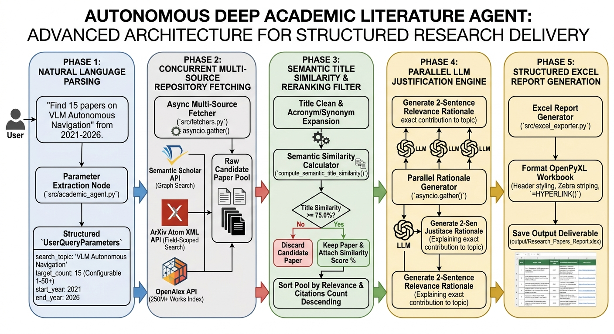

# 🚀 Research_Agent: Autonomous Deep Academic Literature Agent

> **An autonomous agentic workflow for multi-source academic paper retrieval, >75% semantic title similarity filtering, parallel LLM relevance justification, and automated Excel reporting.**

---

## 📌 Project Overview

**`Research_Agent`** transforms natural language research prompts (e.g., *"Find 15 papers on VLM based Autonomous Navigation from 2021 to 2026"*) into curated, highly cited, and mathematically validated literature reports.

Unlike generic search tools, `Research_Agent` coordinates **concurrent API queries across 250M+ open-access works**, calculates **semantic title similarity against a strict >75.0% threshold**, generates **paper-specific 2-sentence relevance rationales**, and outputs styled Excel workbooks formatted with clickable links and citation metrics.

---

## 🏗️ Architectural Overview & Dataflow Diagram




---

## 🛠️ Software Toolkits, APIs & Frameworks Used

| Category | Toolkit / Component | Purpose in Project |
| :--- | :--- | :--- |
| **Core Workflow Engine** | **LangGraph v0.2+** | State graph state-machine orchestration (`StateGraph`, `AgentState`). |
| **LLM Interface** | **LangChain OpenAI / Ollama** | Structured parameter parsing & paper-specific relevance justification. |
| **Data Schema Validation**| **Pydantic v2** | Strict typing for parameters (`UserQueryParameters`) and papers (`ResearchPaper`). |
| **Async Networking** | **Python Asyncio & HTTPX** | Concurrent non-blocking HTTP GET calls to 3 academic APIs (`asyncio.gather`). |
| **Academic API 1** | **Semantic Scholar Graph API** | Retrieves metadata, DOIs, abstracts, and citation counts (`citationCount`). |
| **Academic API 2** | **ArXiv Atom XML API** | Field-scoped query search (`(ti:... OR abs:...)`) with fallback relaxation. |
| **Academic API 3** | **OpenAlex API** | Search over 250M+ open-access academic works (`cited_by_count`). |
| **Semantic Matching** | **Python Difflib & Regex** | Title token Jaccard similarity, SequenceMatcher ratio, and synonym expansion. |
| **Report Exporter** | **OpenPyXL** | Native Excel formatting, `=HYPERLINK()` formulas, zebra striping, and autowidths. |

---

## 📂 Directory Structure

```
Research_Agent/
├── config/                         # Configuration & API Key Credentials
│   ├── .env                        # Active environment variables
│   └── .env.example                # Sample environment template
├── results/                        # Input User Experimental Results (.docx, .pdf)
│   └── Copy of Results_testing_21_05_2026.docx
├── src/                            # Core Agent Source Code
│   ├── agent_schema.py             # Pydantic v2 models & LangGraph AgentState
│   ├── fetchers.py                 # Multi-source fetcher & >75% similarity filter
│   ├── results_parser.py           # Ingests user docx/pdf reports & XML tables
│   ├── excel_exporter.py           # OpenPyXL report generator with file-lock protection
│   └── academic_agent.py            # Main LangGraph State Machine Workflow
├── templates/                      # IEEE LaTeX Class & Template Assets
│   └── IEEEtran.cls
├── output/                         # Generated Output Deliverables
│   └── Research_Papers_Report.xlsx # Citation-sorted literature report with similarity scores
├── README.md                       # Comprehensive Project Guide
├── requirements.txt                # Dependency list
└── main.py                         # CLI Driver Launcher
```

---

## ⚡ Quickstart & Execution Commands

### 1. Install Dependencies
```bash
pip install -r requirements.txt
```

### 2. Configure Environment Variables
Copy `.env.example` to `config/.env` and set your OpenAI API key (optional for cloud LLM; fallback regex parser runs automatically if quota is exceeded):
```bash
OPENAI_API_KEY=your_openai_api_key_here
```

### 3. Run Literature Search
Execute the agent CLI launcher:
```bash
python main.py --prompt "provide me the most related 15 papers on VLM based Autonomous navigation from 2021 to 2026"
```

---

## 📊 Output Excel Report Format

The agent generates **`output/Research_Papers_Report.xlsx`** containing:

| Column | Description |
| :--- | :--- |
| **S.No** | Sequential paper rank (1 to N). |
| **Paper Title** | Verified paper title from academic repository. |
| **Publication Year** | Publication year within requested window (e.g., 2021–2026). |
| **Citations Count** | Total citation count (sorted descending). |
| **Title Similarity %** | Semantic title similarity score (**Must be $\ge 75.0\%$**). |
| **Relevance Justification** | 2-sentence rationale detailing *why* paper was selected and *how* it advances topic. |
| **DOI / Paper Link** | Clickable native Excel hyperlink (`=HYPERLINK()`) to verified paper URL. |

---

## 📜 License

Distributed under the **MIT License**. Free for academic and commercial research use. check 
